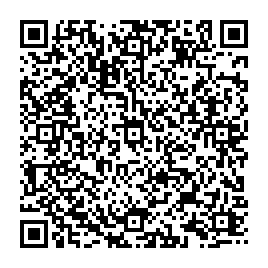

# Aufgaben 1 - Daten Codieren

## 1
Im gleichen Ordner

## 2
https://www.ascii-code.com/de

## 3
a)  1 - ANCII 
    2 - UTF8 $
    3 - UTF16 BE BOM
b) 71
c) 1 - 68 2 und 3 - 71
d) ä und €
e) BE wird zuerst den wichtigsten Byte speichern, LE wird zuerst den unwichtigsten Byte speichern.
f) Gewisse Zeichen werden zu anderen Zeichen umgewandelt auf andere durch die Codierung.
g) Ein einzelnes Byte repräsentiert ASCII-Zeichen und hat das höchste Bit auf Null gesetzt.
Mehrbyte-Zeichen beginnen mit einem Byte, das eine bestimmte Anzahl von führenden Einsen aufweist, um anzuzeigen, wie viele Bytes insgesamt für das Zeichen verwendet werden.
Die folgenden Bytes eines mehrbyte-Zeichens beginnen mit dem Muster "10", um sie von Anfangsbuchstaben zu unterscheiden.j
diese sind Teil vom BYTE.

## 4
Youtube link you Never gonna give you up von Rick Astley


## 5
```
[Date: 2024-03-01 19:00]
[Ticket Number: ABC123]
[Seat Number: 123]
[Sector: A]
[Visitor ID: 123456789]
```
Ja, es bräuchte noch eine Checksum oder so etwas Ähnliches. Am besten weisst man das Ticket am besten gleich zu begin einer Person zu, dann kann niemand es klauen oder wenn die ID genug unberechenbar ist, könnte sie auch als validierung für ein Spiel dienen. Dafür müssten aber wieder die Scanner online sein.


# Aufgaben 2

## 1
Filesystemen.

Binären Baum hat immer zwei äste 0 oder 1. Ein nicht binärer baum, kann mehr haben.

## 2
Nasenbaerjunges
110101101000101110001100111111101001101100000010
char	code
e	00
a	011
s	010
n	101
N	1101
b	1100
r	1111
j	1110
u	1001
g	1000


Sandros:
0100 1111 1010 00 0110 0111 1110 00 110 100 0101 1011 100 110
Symbol    Huffman Code
t         00
e         100
r         110
T         0100
a         0101
c         0110
h         0111
i         1010
m         1011
s         1110
w         1111

Twitchstreamer

## 3
Es müsste noch eine Farbe definiert werden.
5bit | 9bit ()
