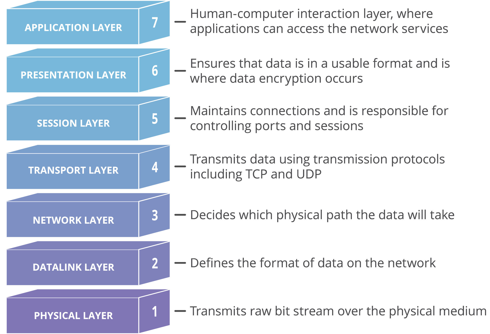

# KRYPTOGRAFIE PGP

## Aufgaben

### 1. Wie kann ich einen Public-Key verifizieren?

Dazu benötigt man den dazugehörigen Fingerabdruck, dieser ist der Hash des Publik-Keys und dient zur Überprüfung der Integrität des Keys.

### 2. Was versteht man unter Public Key Infrastruktur (PKI)?

Public Key Infrastruktur (PKI) ist ein System von Hardware, Software, Personen, Richtlinien und Verfahren, das zur Verwaltung von Public-Key-Zertifikaten und zur Absicherung der Kommunikation zwischen zwei Parteien verwendet wird.

### 3. Was bedeutet Certification-Authority (CA) und was Trust-Center (TC)?

Eine Certification Authority (CA) ist eine vertrauenswürdige Instanz, die digitale Zertifikate ausstellt und die Identität von Personen oder Organisationen überprüft. Ein Trust-Center (TC) ist ein sicherer Ort, an dem digitale Zertifikate und Schlüssel sicher aufbewahrt und verwaltet werden. Ein Trust-Center kann auch als Zertifizierungsstelle (CA) fungieren und digitale Zertifikate ausstellen.

### 4. Wer hat das Zertifikat für die Bankwebseite [www.ubs.com](https://www.ubs.com/) ausgestellt und wie lange ist es gültig?

DigiCert Inc
Gültig bis Freitag, 13. Dezember 2024 um 00:59:59

### 5. Wer hat das Zertifikat für die für die Schulwebseite [www.tbz.ch](https://tbz.ch/) ausgestellt und wie lange ist es gültig?

Let's Encrypt
Gültig bis Sonntag, 30. Juni 2024 um 19:35:24

### 6. Wer hat das Zertifikat für die für die Webseite [www.example.ch] ausgestellt und wie lange ist es gültig?

Haben kein Zertifikat.

### 7. Wählen sie irgendeine Applikation aus, die auf ihrem PC installiert ist. Stellen sie sich nun vor, sie müssten diese von Hand aktualisieren oder aus Kompatibilitätsgründen auf eine frühere Version zurückstufen. Wo finden sie aktuelle und frühere Versionen ihrer Software und wie wird sichergestellt, dass die dort angebotene SW-Version auch wirklich echt ist bzw. vom SW-Entwickler stammt?

Auf der offizielle Website der Software gibt es meistens eine Download Seite, wo die gewünschte Version heruntergeladen werden kann. Um dies zu prüfen gibt es meisten eine digitale Signatur.

### 8. Erstellen sie eine virtuelle Linux-Maschine mit z.B. VirtualBox und Ubuntu. Richten sie nun auf ihrem WIN-PC eine Remoteverbindung via ssh zu ihrem Linux-PC ein. Überprüfen sie die Verbindung. Wäre auch eine graphische Anbindung möglich?

Out of the Box geht nur eine Shell connection also über Commandline für graphische anbindungen braucht man extra tools.

### 9. In dieser Übung untersuchen wir eine http-Verbindung und eine https-Verbindung mit dem Network-Sniffer Wireshark:

- [https://www.wireshark.org/](https://www.wireshark.org/)
- [http://www.example.ch](http://www.example.ch)
- [https://www.zkb.ch](https://www.zkb.ch)

#### Untersuchen sie speziell die OSI-Layer 2,3,4 und 7. Was stellen sie fest? Wo liegen die Unterschiede zwischen http und https? Zusatzfrage: Kann man mit Wireshark bei einer https-Verbindung trotzdem herausfinden, welche Webseite besucht wurde?

Bei Layer 2 und 3 verlassen sich http und https auf das genau gleiche und interagieren dammit nicht wirklich.

Layer 4 bring uns zum ersten unterschied, obwohl beide das TCP (Transmission Control Protokoll) nehmen, verschlüsselt https zusätzlich mit SSL/TLS (Secure Sockets Layer/Transport Layer Security).

Auf Layer 7 passiert die eigentliche Kommunikation, die bei http text basiert ist, deshalb kann man hier auch so eifach mit Wireshark ablesen. HTTPS macht genau das gleiche nur ist der text encrypted, von Layer 4 aus.

Bei http ist alles unverschlüsselt und mit wireshark kann man bei HTTPS immer noch sehen auf welche IP (Domain) die Pakete gehen, also Ja.

### 10. Öffnen sie die beiden folgenden Webseiten und achten sie auf die Unterschiede in der Webadresszeile. Was stellen sie bezüglich Protokoll und Zertifikat fest?

Zweie.

- [https://juergarnold.ch](https://juergarnold.ch)
- [https://www.zkb.ch](https://www.zkb.ch)

### 11. Wenn sie sich mit Zertifikaten befassen, fallen ihnen früher oder später folgende Anbieter bzw. Webseiten auf:
http://www.cacert.org
https://letsencrypt.org/de
Was genau wird hier zu welchen Konditionen angeboten?

Gratis Zertifikate, die Community unterstützt sind. Man muss beweissen, das man die Kontrolle über die Domain hat.

### 12. Folgende TLS Zertifikatsarten werden unterschieden:
Domain Validated, Organization Validated und Extended Validation.
Sie möchten einen Webshop betreiben, wo mit Kreditkarte bezahlt werden kann.
Welcher Zertifikatstyp ist der richtige?

Extended Validation, aber gewisse Zahlungsanbieter bieten auch einbindbare Fertige Seiten für die Validierung an die bereits secure sind.

### 13. Studieren sie den Beitrag auf der Webseite Let's Encrypt "Wie es funktioniert"
https://letsencrypt.org/de/how-it-works/
Was ist der Unterschied zwischen OpenPGP und X.509?

OpenPGP, kann von absolut jedem signed, also verifiziert werden, x.509 jedoch kann nur von Authentifizierten stellen verifiziert werden.

x.509 ist zwar in OpenPGP unterschützt aber nicht kompatibel

### 14.
Https ist eigentlich http + TLS, das heisst es wird einfach nur der Inhalt eins HTTP Pakets mit TLS verschlüsselt. Die restlichen informationen werden immer noch gebraucht, dass das Paket an sein Zielt kommt un können nicht verschlüsselt werden.

Die schlüsselpaare werden mit PKI ausgetauscht und so wird eine Sichere Verbindung gewährleistet.

